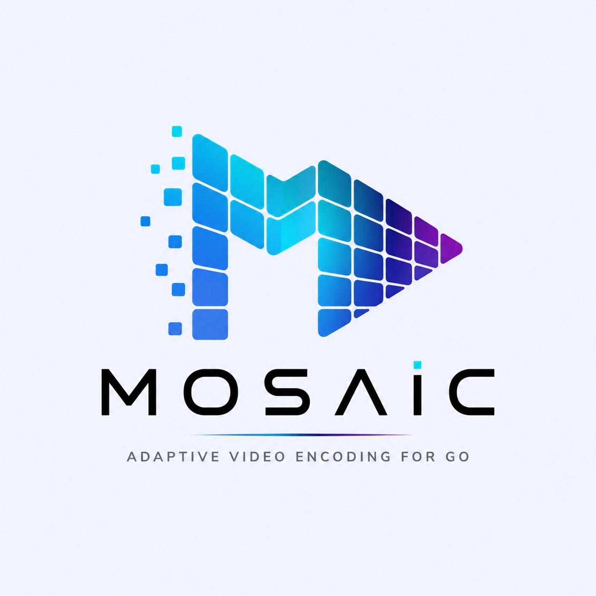

  

# Mosaic <small>v1.7.2</small>

> Predictable, Production-Ready Adaptive Bitrate (ABR) Video Packaging for Go

- Standardized HLS (fMP4) & DASH CMAF Packaging
- Automatic Aspect-Preserving Ladders (No Black Bars)
- Display Matrix & Orientation Normalization
- Accurate Real-Time Progress Monitoring
- GPU Hardware Acceleration (NVENC / VAAPI / VideoToolbox)

[Get Started](README.md)
[GitHub](https://github.com/farshidrezaei/mosaic)
